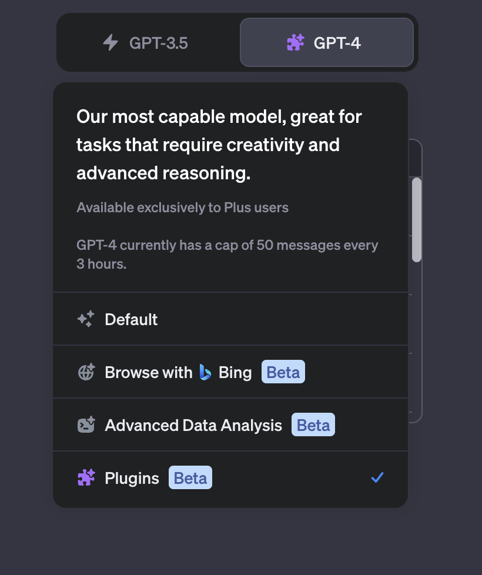
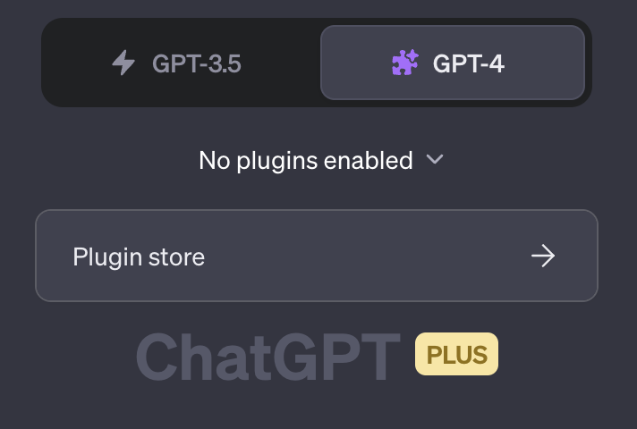
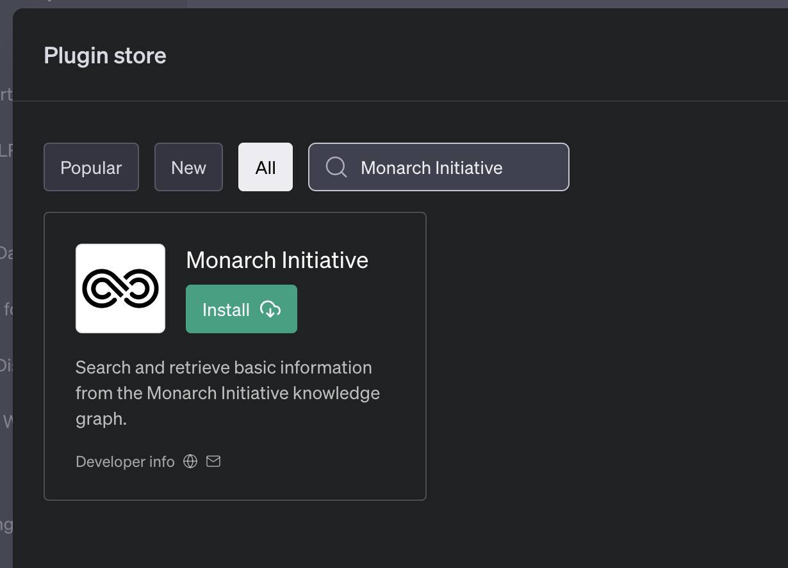
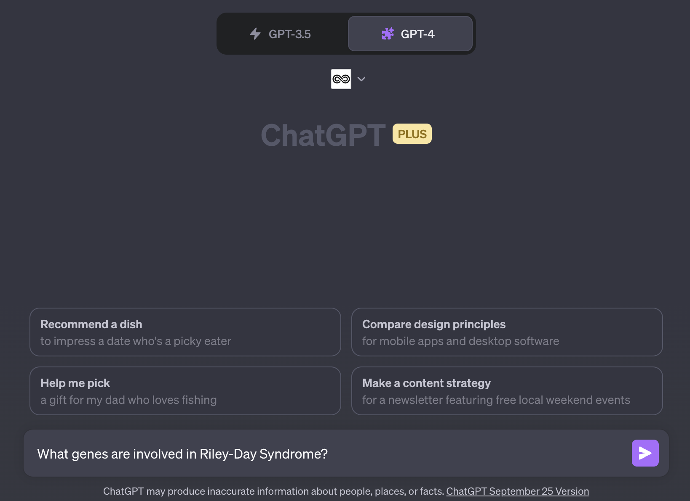

# Monarch Initiative ChatGPT Plugin

The Monarch Initiative ChatGPT plugin is available to all [ChatGPT Plus subscribers](https://openai.com/blog/chatgpt-plus) through the ChatGPT Plugin store. For more information about the Monarch ChatGPT plugin, see our [blog post](https://monarchinit.medium.com/knowledge-backed-ai-with-monarch-a-match-made-in-heaven-a8296eec6b9f).

## Enabling the Plugin

If you are an OpenAI ChatGPT Plus subscriber, then you have access to the more-capable GPT-4 model, as well as the corresponding Plugin store. To get started, begin by selecing the GPT-4 Plugins model from the dropdown at [https://chat.openai.com](https://chat.openai.com). 



Once the GPT-4 Plugins model has been selected, you'll have the opportunity to add plugins via the store:



To install the plugin, search for "Monarch" in the store and click the Install button:



When the plugin is installed and enabled, the Monarch logo (an infinity-like symbol) will show near the top, and you can ask a natural language question about diseases, genes, or phenotypes.




## For Developers

### Get access to the ChatGPT plugin developer program

Developers will need to be accepted to the OpenAI developer program

Join the waitlist [here](https://openai.com/waitlist/plugins). See also https://community.openai.com/t/developer-access-for-colleagues/157315

### Run dev server

Run the dev server with `make dev`, which runs on localhost port 3434.

Check it works:

- http://localhost:3434/.well-known/ai-plugin.json
- http://localhost:3434/docs

### Test plugin

Go to https://chat.openai.com/

If you have plugin access, you'll see an option to select the GPT-4 plugin model from the top drop down, then select “Plugins”, “Plugin Store”, and finally “Install an unverified plugin” or “Develop your own plugin”.

Enter `localhost:3434`

You should see the plugin activated.

If you run into difficulties, see https://platform.openai.com/docs/plugins/introduction

### Production deployment

Production requires `docker` and is run via `make prod`. 

The production server runs on port 8080 via docker and assumes SSL termination happens upstream.
To properly act as a plugin, the path `/.well-known/ai-plugin.json` must include the URL of the API, which in prod is `https://oai-monarch-plugin.monarchinitiative.org`, and in dev is `http://localhost:3434`. These are configured by environment variables in the `docker-compose.yml` and `Makefile` respectively.

Output of `make help`:

```bash
DEV:
  make dev -- installs requirements, runs hot-restart dev server
  make test -- runs tests
  make queries -- runs tests against dev server (not via pytest, assumes dev server is running)
  
PROD:
  make prod -- installs requirements, exports requirements.txt, builds and runs dockerized prod server
  make docker-build -- build docker container
  make docker-run -- run make start-prod in docker via docker-compose
  make start-prod -- runs production server
  
ETC:
  make install -- run poetry install
  make export-requirements -- exports requirements.txt
  make help -- show this help
```

# Acknowledgements

This [cookiecutter](https://cookiecutter.readthedocs.io/en/stable/README.html) project was developed from the [monarch-project-template](https://github.com/monarch-initiative/monarch-project-template) template and will be kept up-to-date using [cruft](https://cruft.github.io/cruft/). Makefile modified from [Sierra Moxon's](https://github.com/geneontology/go-fastapi/blob/main/Makefile).
